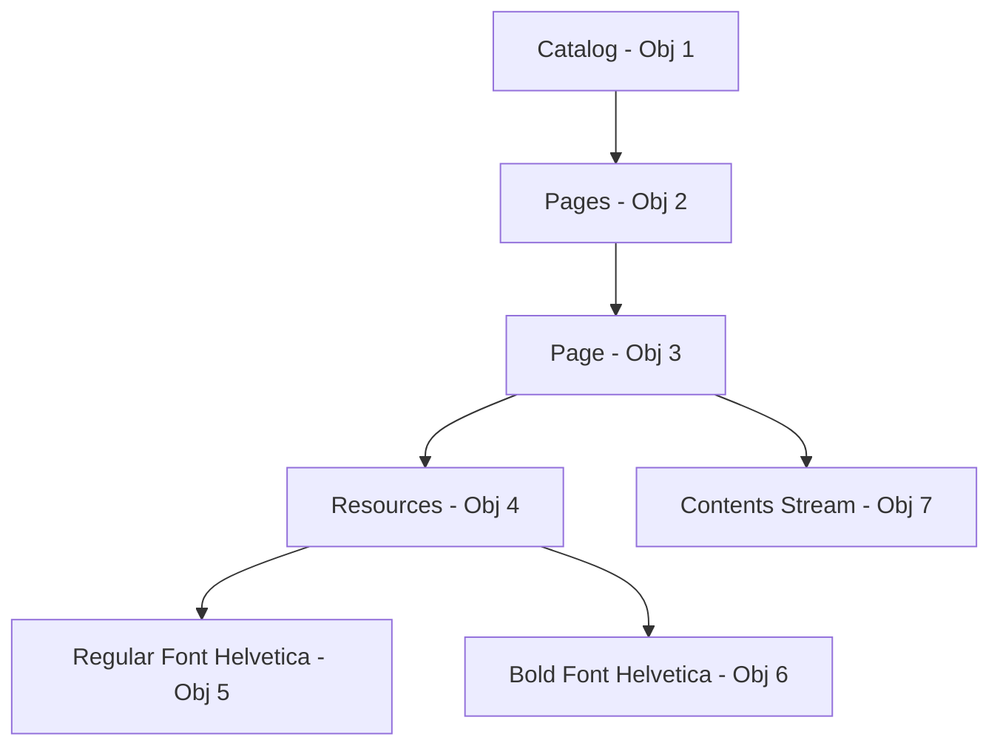

# Wi-Fi Password Security Auditor

[](https://www.python.org/)
[](https://docs.python.org/3/library/tkinter.html)
[](LICENSE)
[-brightgreen.svg)](#tech-stack--architecture)

A professional, commercial-grade desktop security suite built in Python for auditing, evaluating, and generating resilient Wi-Fi passwords. The application is designed to assist system administrators, cybersecurity professionals, and home users in assessing whether their wireless network keys are resilient against offline dictionary cracking and high-speed GPU brute-force attacks.

> [!IMPORTANT]
> **Defensive & Educational Scope Policy**
> This application is strictly a defensive, local self-auditing tool. It **never** attempts to capture handshakes over the air, perform active brute-forcing, bypass wireless authentication protocols, or connect to unauthorized networks. It operates entirely offline in memory to evaluate user-provided keys, ensuring no sensitive credentials ever transit the network.

---

## Table of Contents

- [The Security Context: Why Wi-Fi Keys Matter](#the-security-context-why-wi-fi-keys-matter)
- [Key Features](#key-features)
- [Mathematical & Algorithmic Specifications](#mathematical--algorithmic-specifications)
  - [1. Shannon Entropy Formula](#1-shannon-entropy-formula)
  - [2. Password Strength Scoring Rules](#2-password-strength-scoring-rules)
  - [3. Crack Time Estimator Speeds](#3-crack-time-estimator-speeds)
  - [4. Custom Byte-Level PDF Architecture](#4-custom-byte-level-pdf-architecture)
- [Tech Stack & Architecture](#tech-stack--architecture)
  - [Project Directory Structure](#project-directory-structure)
- [System Prerequisites & Installation](#system-prerequisites--installation)
- [Visual User Manual](#visual-user-manual)
  - [1. Password Auditor View](#1-password-auditor-view)
  - [2. Password Generator View](#2-password-generator-view)
  - [3. Exporting Audit Reports](#3-exporting-audit-reports)
- [Developer & Verification Guide](#developer--verification-guide)
- [License](#license)

---

## The Security Context: Why Wi-Fi Keys Matter

In modern wireless network topologies (WPA2-PSK and WPA3-SAE), the security of the local network hinges entirely on the strength of the Pre-Shared Key (PSK). Under WPA2, if an attacker intercepts the 4-way authentication handshake over the air (which can be done silently from outside a building), they can take that handshake offline. 

Once offline, the attacker is no longer throttled by the router's hardware or network delays. They can use high-performance GPU clusters to guess passwords at speeds exceeding **100 trillion attempts per second**. Therefore, standard passwords like names, simple character runs, or dates can be cracked in milliseconds. Having a mathematically sound, entropy-rich, and complex credential is the absolute primary layer of defense for your local area network (LAN).

---

## Key Features

- **Interactive Cyberpunk Dashboard**: A modern, sleek dark-mode desktop interface utilizing custom-drawn animated canvases, a sweeping circular strength meter, and dynamic status indicators.
- **Advanced Security Scoring**: Evaluates password configurations on a granular scale of `0` to `100` using length criteria, character pool diversity bonuses, and strict contextual pattern penalties.
- **Shannon Entropy Calculator**: Computes mathematical entropy bits ($L \log_2 R$) and active pool sizes representing true mathematical complexity.
- **Offline Crack Time Estimator**: Projects brute-force durability under three distinct attack vectors (Throttled Online, Desktop GPU, and High-Performance GPU Cluster).
- **Deep Pattern Search Engine**: Flags keyboard walks (e.g., `qwe`, `asdf`), alphabetical runs (`abc`), consecutive character repeats, common dictionary words, and personal identifiers (birth years, emails, and phone numbers).
- **Dual-Mode Cryptographic Generator**:
  - **Random Password Mode**: Standard character pool randomization (excluding ambiguous characters like `l`, `1`, `O`, `0`) with a length range of `8-64` characters.
  - **Memorable Passphrase Mode**: NIST SP 800-63B compliant multi-word passphrases using Python's secure `secrets` module and a robust 100+ word dictionary.
- **Dependency-Free Exporters**: Outputs report packages in machine-readable JSON, terminal-friendly TXT, or print-ready high-fidelity PDF formats without requiring any external libraries.

---

## Mathematical & Algorithmic Specifications

### 1. Shannon Entropy Formula

Entropy measures the amount of uncertainty or unpredictability in the password structure. The tool calculates this as:

$$H = L \times \log_2(R)$$

Where:
- **$H$** = Entropy in bits.
- **$L$** = Length of the password.
- **$R$** = Size of the character pool based on matched character sets.

#### Character Pools ($R$) Allocation Table:
| Character Set | Description | Pool Size Contribution |
| :--- | :--- | :---: |
| `[a-z]` | Lowercase Latin letters | 26 |
| `[A-Z]` | Uppercase Latin letters | 26 |
| `[0-9]` | Numeric digits | 10 |
| `[^a-zA-Z0-9\s]` | Special symbols / punctuation | 33 |
| Non-ASCII | Characters with Ordinal > 127 | 100 |

### 2. Password Strength Scoring Rules

The analyzer class calculates the final score out of `100` points. The score starts at `0` and is calculated using the following cumulative logic:

#### Base Additions:
1. **Length points**: Up to `42` points calculated as $L \times 3.5$.
2. **Length bonus**: A flat `+8` points if the password is at least `12` characters long.
3. **Character diversity pools**:
   - Contains Lowercase: `+10` points
   - Contains Uppercase: `+10` points
   - Contains Numbers: `+10` points
   - Contains Special Symbols: `+10` points
   - Contains Unicode characters: `+5` points

#### Base Deductions & Penalties:
- **Homogeneous character set**: `-15` points if the password is only alphabetic or only numeric.
- **Keyboard rows / sequences**: `-10` points if keyboard sequences like `qwe`, `asd`, or `123` are found (forwards or backwards).
- **Alphabetical sequences**: `-10` points if consecutive runs like `abc` or `zyx` are found.
- **Repeated characters**: `-10` points if three or more identical characters are consecutive (e.g., `aaa`).
- **Low unique character diversity**: `-10` points if unique characters make up less than 50% of the password length.
- **Contextual birth year patterns**: `-5` points if four-digit strings matching years between `1900` and `2029` are present.
- **Contextual phone number patterns**: `-10` points if a sequence of 7 to 10 consecutive digits is found.
- **Contextual email patterns**: `-15` points if an email structure (`user@domain.ext`) is found.
- **Whitespace character**: `-5` points for containing spaces (as they can sometimes cause configuration errors on certain old routers, though useful in passphrases).
- **Dictionary check**: If the password matches any entry in the 1,000 common passwords file (`common_passwords.json`), the score is immediately capped at a maximum of `10` (or `5` if the score is already high).

#### Final Rating Bands:
| Score Range | Strength Rating | UI Meter Color |
| :---: | :--- | :---: |
| `0 - 20` | Very Weak | Red (`#EF4444`) |
| `21 - 40` | Weak | Orange (`#F97316`) |
| `41 - 60` | Fair | Yellow (`#EAB308`) |
| `61 - 80` | Good | Emerald Green (`#10B981`) |
| `81 - 90` | Strong | Cyan (`#06B6D4`) |
| `91 - 100` | Excellent | Royal Blue (`#3B82F6`) |

---

### 3. Crack Time Estimator Speeds

The cracking estimation is calculated by dividing total combinations ($C = R^L$) by the target attack speed scenario:

1. **Online Throttled Attack** (100 guesses/second): Mimics an attacker trying to connect directly to the router or an online login portal, which actively restricts high-speed attempts.
2. **Desktop GPU Offline Attack** (10,000,000,000 guesses/second or 10 GH/s): Mimics a single attacker running a modern consumer GPU (like a Nvidia RTX 4090) cracking a captured handshake offline.
3. **GPU Cluster Offline Attack** (100,000,000,000,000 guesses/second or 100 TH/s): Mimics an enterprise-level brute-force server rig or a botnet cluster executing massive parallel operations.

---

### 4. Custom Byte-Level PDF Architecture

To guarantee the tool is zero-dependency, `report.py` implements a custom, low-level PDF document writer that writes raw PDF objects directly to files.

#### PDF 1.4 Object Graph:

The generator builds the layout, text, colored rating boxes, and security grids, then calculates the byte offsets for the Cross-Reference (xref) table before closing with the `trailer` segment to ensure complete Adobe-compliant PDF output.

---

## Tech Stack & Architecture

- **Language**: Python 3.11+
- **GUI Engine**: Tkinter / TTK (with custom high-DPI scaling hooks on Windows)
- **Standard Library Modules**: `re`, `math`, `json`, `datetime`, `string`, `secrets`, `os`, `sys`
- **Dependencies**: 100% Standard Library. No external package installations are required.

### Project Directory Structure

```
WiFiPasswordAuditor/
├── main.py                 # Tkinter application UI, event loops, and layout frames
├── analyzer.py             # Strength rating logic, pattern matching, entropy engine
├── password_generator.py   # Cryptographically secure random password & passphrase generator
├── report.py               # Document exporters for JSON, TXT, and custom binary PDF reports
├── common_passwords.json   # JSON array containing the 1,000 most common leaked credentials
├── verify_backend.py       # Automated testing script validating all modules and math models
├── README.md               # User manual and architectural specifications
├── reports/                # Local directory for exported reports (created on demand)
└── assets/                 # Folder for styling references and icons
```

---

## System Prerequisites & Installation

### Prerequisites:
- **Operating System**: Windows (10/11), macOS, or Linux.
- **Python Version**: Python 3.11 or higher.
- **Tkinter Package**: Usually bundled with standard python installations. 
  - *Linux users (Ubuntu/Debian) might need to run*: `sudo apt-get install python3-tk`

### Installation Steps:
1. Clone the repository or extract the files to a directory on your machine.
2. Open a terminal or PowerShell prompt and navigate to the directory:
   ```bash
   cd WiFiPasswordAuditor
   ```
3. Execute the application:
   ```bash
   python main.py
   ```

---

## Visual User Manual

```
+--------------------------------------------------------+
|  🛡 WIFI AUDITOR   |  Wi-Fi Password Security Auditor   |
|                    |                                   |
|  [Password Auditor]|  [Enter Wi-Fi Password... ]       |
|  [Generator]       |  [Show] [Analyze Security]        |
|  [Security Notice] |                                   |
|                    |  +-----------------------------+  |
|                    |  |   Circular Strength Meter   |  |
|                    |  |       (Anim Arc Gauge)      |  |
|                    |  +-----------------------------+  |
|                    |  [Checklist]    [Recommendations] |
|                    |  -----------------------------    |
|  Defensive Tool    |  Export: [JSON] [TXT] [PDF]       |
+--------------------------------------------------------+
```

### 1. Password Auditor View

The Auditor is the primary panel loaded on startup.

1. **Input Fields**:
   - Type your target Wi-Fi password in the password entry field.
   - Click the **👁 Show / Hide** button to toggle character masking.
2. **Analysis Execution**:
   - Click the **Analyze Security** button or press the **Enter key** while inside the entry field.
   - The circular strength meter will sweep from `0` to the target percentage, displaying the strength rating and the entropy rating inside the circle.
3. **Checklist Interpretation**:
   - A green checkmark (**✔**) indicates a security gate has been passed.
   - A red cross mark (**✘**) indicates a failure condition. Review the checklist to identify vulnerabilities such as low entropy, common lists, or sequential runs.
4. **Actionable Recommendations**:
   - View the scrollable recommendations section. Up to six key steps will be contextually prioritized based on the vulnerabilities detected in the input string.

---

### 2. Password Generator View

Click the **Password Generator** tab in the sidebar menu.

#### Random Password Mode (Standard)
1. Select the **Random Password (Standard)** radio button.
2. Use the **Password Length** slider to choose a size from `8` to `64` characters (recommended length: `16` or higher).
3. Toggle options based on your router's capability:
   - Include Uppercase Letters
   - Include Lowercase Letters
   - Include Numbers
   - Include Special Symbols
   - Exclude Ambiguous characters (excludes `1`, `l`, `o`, `0`, etc., to avoid manual typos when entering keys on physical devices).
4. Click **Generate Secure Key**.

#### Memorable Passphrase Mode (NIST Standard)
1. Select the **Memorable Passphrase (NIST Standard)** radio button.
2. Slide the **Number of Words** bar to choose a count between `3` and `10` words (recommended count: `4` or more).
3. Enter your preferred separator character in the **Separator Symbol** text entry field (default is `-`).
4. Toggle **Capitalize Each Word** to apply Title Case constraints.
5. Click **Generate Secure Key**.

#### Generator Actions
- **Copy to Clipboard**: Copies the generated credential to your system clipboard with visual confirmation feedback.
- **Load into Security Auditor**: Automatically loads the new key back into the Auditor panel and executes a comprehensive security analysis.

---

### 3. Exporting Audit Reports

Once a password analysis is completed, the export panel buttons in the footer will activate.

- **JSON Format**: Writes a structured JSON file containing metadata, ratings, exact entropy bits, and checklist tables. Ideal for security log pipelines.
- **TXT Dashboard**: Generates a terminal-readable representation of the audit metrics, perfect for standard logging or email copy-pasting.
- **PDF Document**: Generates a professional, print-ready document with colored rating cards, checklist grids, and explicit security instructions.

All reports will default to saving within the local `/reports` folder, but can be saved anywhere via the OS file selector.

---

## Developer & Verification Guide

Developers can test the system's mathematics, string analyzers, generators, and PDF exporters using the built-in unit-testing tool.

### Running Backend Tests:
Execute the test file in your terminal:
```powershell
python verify_backend.py
```

### Expected Output Summary:
```
==================================================
RUNNING WI-FI PASSWORD SECURITY AUDITOR TESTS
==================================================
[1/5] Initializing modules...
  - Modules successfully initialized.

[2/5] Testing analysis on weak password ('123456')...
  - Score: 5/100
  - Rating: Very Weak
  - Entropy: 15.51 bits
  - Is Not Common Checklist: False
  - Weak password checks passed.

[3/5] Testing analysis on strong password ('C0mplex_P@ssw0rd_2026')...
  - Score: 95/100
  - Rating: Excellent
  - Entropy: 120.3 bits
  - Checklist status: All ticks: True
  - Strong password checks passed.

[4/5] Testing cryptographically secure generator...
  - Generated Standard (18 chars): u[N#&m1_pW*R$Q!7@y
  - Generated Passphrase (5 words): Meadow-Meteor-Falcon-Echo-Glacier
  - Generator checks passed.

[5/5] Testing report exporters (JSON, TXT, PDF)...
  - Files written to: C:\Users\mariy\OneDrive\Documents\internship\codtech\2026\wifi password\WiFiPasswordAuditor\reports
  - Exporter checks passed.

==================================================
SUCCESS: ALL WI-FI SECURITY AUDITOR TESTS PASSED!
==================================================
```

---

## License

This project is licensed under the MIT License - see the [LICENSE](LICENSE) details for details.
